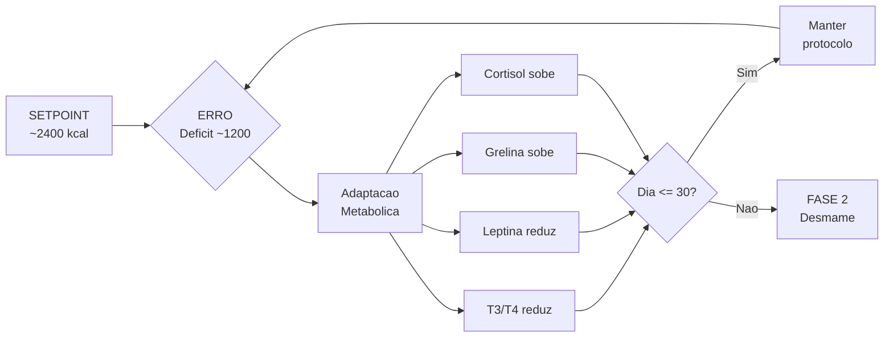

## 2. Embasamento Científico (Backend da Biologia)
A versão atual baseia-se em três pilares para evitar o esgotamento sistêmico:

1. **Déficit de Curto Prazo Monitorado:** O corte calórico é tratado como uma intervenção pontual. A segurança e a execução correta importam mais do que forçar o número da balança para baixo a qualquer custo. [web:52][web:68]
2. **Proteína como Eixo Estrutural:** Em fases de déficit energético somado a exercício, a alta ingestão proteica é a melhor ferramenta para blindar a massa magra contra o catabolismo. [web:56][web:69]
3. **Exercício e Mobilização Lipídica:** O exercício aeróbico na Zona 2, aliado ao jejum intermitente fisiológico da manhã, favorece a mobilização de ácidos graxos sem gerar estresse sistêmico severo. [web:20]

### 2.1. Feedback Loop Metabólico (O Termostato do Corpo)
O organismo opera como um sistema de controle com *feedback negativo*. Quando o déficit é detectado, o corpo ajusta variáveis internas para conservar energia. Entender esse loop é essencial para não entrar em pânico com sintomas esperados:

```
SETPOINT (Termostato)  = Gasto Total (~2.400 kcal)
INPUT    (Consumo)     = ~1.200 kcal/dia
ERROR    (Deficit)     = ~1.200 kcal/dia -> corpo entra em modo de economia

-- RESPOSTA DO SISTEMA (Adaptacao Metabolica) --

  Dia 1-7:   T3/T4 -leve     | Leptina --      | Grelina ++
             -> Sintomas: fome intensa, irritabilidade, sono leve
             -> Acao: ESPERADO. Nao abortar. Usar patches do Cap. 9.

  Dia 8-20:  T3/T4 -moderado | Leptina ---     | Cortisol +
             -> Sintomas: plato na balanca, retencao hidrica
             -> Acao: ESPERADO. Confiar nas fotos semanais (Secao 1.3).

  Dia 21-30: Adaptacao parcial | TDEE efetivo -5-10%
             -> Sintomas: energia estabiliza, fome reduz
             -> Acao: NAO prolongar alem de 30 dias. Iniciar Fase 2.

-- HARD DEADLINE --
  after(day == 30) -> OBRIGATORIO: trigger FASE_2.desmame()
  // Prolongar o deficit causa: T3 colapso, leptina zero,
  // catabolismo muscular, fadiga cronica. [web:60][web:63][web:65]
```


