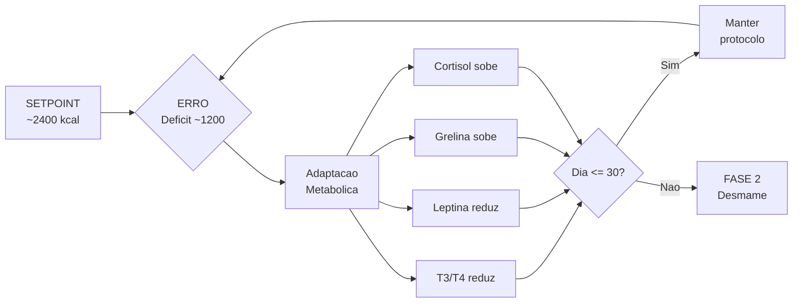

## 2. Embasamento Científico (Backend da Biologia)
A versão atual baseia-se em três pilares para evitar o esgotamento sistêmico:

1. **Déficit de Curto Prazo Monitorado:** O corte calórico é tratado como uma intervenção pontual. A segurança e a execução correta importam mais do que forçar o número da balança para baixo a qualquer custo. [web:52][web:68]
2. **Proteína como Eixo Estrutural:** Em fases de déficit energético somado a exercício, a alta ingestão proteica é a melhor ferramenta para blindar a massa magra contra o catabolismo. [web:56][web:69]
3. **Exercício e Mobilização Lipídica:** O exercício aeróbico na Zona 2, aliado ao jejum intermitente fisiológico da manhã, favorece a mobilização de ácidos graxos sem gerar estresse sistêmico severo. [web:20]

> **Nota sobre proporção exercício/dieta:** O [Capítulo 14](14-exercicio-e-dieta.md) consolida a evidência sobre a contribuição relativa de dieta (motor primário do déficit) e exercício (protetor da composição corporal), incluindo orientações para quem não pode praticar atividade física.

::: {.callout-note}
**Nota Metodológica — Nível de Evidência (GRADE)**

Este protocolo é um documento de estudo pessoal, não uma diretriz clínica. Ainda assim, as recomendações são classificadas informalmente conforme a hierarquia de evidência:

- **Evidência ALTA (⬛⬛⬛⬛):** Meta-análises e revisões sistemáticas de ECRs (ex.: proteção muscular por alta proteína [web:56], creatina em déficit).
- **Evidência MODERADA (⬛⬛⬛⬜):** ECRs individuais com amostra adequada ou coortes prospectivas consistentes (ex.: efeito da cafeína no sono, corte às 14 h).
- **Evidência BAIXA (⬛⬛⬜⬜):** Estudos observacionais, séries de casos, mecanismos fisiológicos extrapolados (ex.: timing de colágeno + Vit C, refeed semanal).
- **Opinião/Prática (⬛⬜⬜⬜):** Consenso de prática clínica sem ECR, experiência anedótica incorporada com ressalva explícita (ex.: "regra do pescoço").

Onde aplicável, os capítulos indicam `[GRADE: ALTA/MODERADA/BAIXA/OPINIÃO]` para que o leitor calibre a confiança na recomendação. A ausência de classificação indica que a evidência não foi formalmente avaliada.

**Classificação GRADE das recomendações-chave do protocolo:**

| # | Recomendação | GRADE | Fonte principal |
|---|---|---|---|
| 1 | Proteína 1,6–2,2 g/kg para preservar massa magra em déficit | ⬛⬛⬛⬛ ALTA | Meta-análise: Morton et al. 2018 [web:56] |
| 2 | Creatina 3–5 g/dia para performance e massa magra | ⬛⬛⬛⬛ ALTA | 500+ ECRs; meta-análises Cochrane [web:56] |
| 3 | Déficit ≤ 30 dias contínuos para minimizar adaptação metabólica | ⬛⬛⬛⬜ MODERADA | ECRs e coortes: Trexler et al. 2014 [web:60][web:63] |
| 4 | Zona 2 aeróbica em jejum para mobilização lipídica | ⬛⬛⬛⬜ MODERADA | ECRs: Aird et al. 2018 [web:20] |
| 5 | Corte de cafeína ≥ 8 h antes de dormir | ⬛⬛⬛⬜ MODERADA | ECRs: Drake et al. 2013 |
| 6 | Refeed semanal para restauração de leptina/T3 | ⬛⬛⬜⬜ BAIXA | Estudos mecanísticos + observacionais [web:60] |
| 7 | Colágeno + Vit C 30–60 min pré-exercício | ⬛⬛⬜⬜ BAIXA | ECR único: Shaw et al. 2017 |
| 8 | Timing de leucina/caseína pré-sono | ⬛⬛⬜⬜ BAIXA | ECRs pequenos: Res et al. 2012 |
| 9 | "Regra do pescoço" para exercício em IVAS | ⬛⬜⬜⬜ OPINIÃO | Consenso clínico sem ECR |
| 10 | Power nap 20 min para recuperação em déficit | ⬛⬜⬜⬜ OPINIÃO | Estudos observacionais; plausibilidade fisiológica |

> **Leitura da tabela:** GRADE refere-se à certeza na evidência, não à importância da recomendação. Uma recomendação BAIXA pode ser clinicamente útil — apenas com menor certeza nos dados.
:::

### 2.1. Feedback Loop Metabólico (O Termostato do Corpo)
O organismo opera como um sistema de controle com *feedback negativo*. Quando o déficit é detectado, o corpo ajusta variáveis internas para conservar energia. Entender esse loop é essencial para não entrar em pânico com sintomas esperados:

```
SETPOINT (Termostato)  = Gasto Total (~2.400 kcal)
INPUT    (Consumo)     = ~1.200 kcal/dia
ERROR    (Deficit)     = ~1.200 kcal/dia -> corpo entra em modo de economia

-- RESPOSTA DO SISTEMA (Adaptacao Metabolica) --

  Dia 1-7:   T3/T4 -leve     | Leptina --      | Grelina ++
             -> Sintomas: fome intensa, irritabilidade, sono leve
             -> Acao: ESPERADO. Nao abortar. Usar patches do Cap. 9.

  Dia 8-20:  T3/T4 -moderado | Leptina ---     | Cortisol +
             -> Sintomas: plato na balanca, retencao hidrica
             -> Acao: ESPERADO. Confiar nas fotos semanais (Secao 1.3).

  Dia 21-30: Adaptacao parcial | TDEE efetivo -5-10%
             -> Sintomas: energia estabiliza, fome reduz
             -> Acao: NAO prolongar alem de 30 dias. Iniciar Fase 2.

-- HARD DEADLINE --
  after(day == 30) -> OBRIGATORIO: trigger FASE_2.desmame()
  // Prolongar o deficit tende a aprofundar queda de T3 e leptina,
  // elevar o risco de catabolismo muscular e fadiga cronica. [web:60][web:63][web:65]
```

### 2.2. Refeed Semanal — Estratégia de Proteção do Eixo Tireoidiano

A leptina circulante cai proporcionalmente à restrição calórica e à perda de tecido adiposo. Esta queda sinaliza ao hipotálamo um estado de "escassez energética", que responde reduzindo a conversão periférica de T4 → T3 (hormônio tireoidiano ativo). O resultado é uma redução do TDEE de 5–10% (adaptive thermogenesis), que desacelera a perda de gordura ao longo dos 30 dias. [web:60][web:63]

**O refeed semanal** é uma estratégia baseada em evidência para atenuar essa cascata:

- **Frequência:** 1 dia por semana (preferencialmente no dia de treino resistido mais intenso).
- **Calorias:** Elevar para **manutenção (~2.400 kcal)**, não acima.
- **Composição:** ↑ carboidratos (aveia, frutas, raízes, arroz), ↓ gordura. Manter proteína estável.
- **Mecanismo:** O aumento agudo de carboidratos e calorias restaura parcialmente a leptina circulante, sinalizando "adequação energética" ao hipotálamo e mantendo a conversão T4 → T3 mais próxima do basal.
- **O que NÃO é:** Não é um "dia livre" (cheat day). Os alimentos devem ser os mesmos do protocolo, apenas em quantidade maior. Ultraprocessados e álcool continuam excluídos.

```
Semana sem refeed:  Leptina ↓↓↓ → T3 ↓↓ → TDEE ↓↓ → Fat loss ↓
Semana com refeed:  Leptina ↓↓  → T3 ↓  → TDEE ↓  → Fat loss mantido
```

Nota de calibracao cientifica: em humanos, a adaptacao costuma aparecer como reducao relevante de T3 e leptina (nao como "zero absoluto"). O racional do limite de 30 dias existe para interromper a piora cumulativa e iniciar a recuperacao controlada na Fase 2. [web:60][web:63][web:65]


