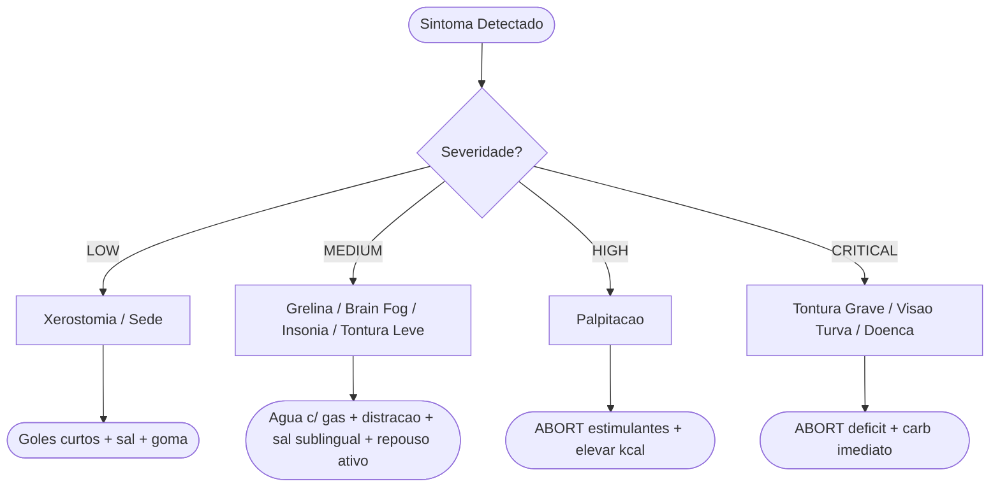

## 9. Troubleshooting Comum (Resolução de Erros)

Um déficit calórico severo (~900 kcal) gera alertas fisiológicos. O corpo tenta frear o gasto energético (downregulation) e aumentar a fome (upregulation de grelina). [web:60]

*As recomendações abaixo são orientações práticas para manter a adesão; não constituem diretrizes clínicas formais.*

### 9.0. Event Map (Mapa de Eventos do Sistema)
O corpo emite "eventos" (sintomas) e o protocolo define "handlers" (respostas). A severidade determina a ação:

```
// -- SEVERITY: LOW --
on(EVENT.XEROSTOMIA)     -> handler: Erro 01 (goles curtos, sal, goma)
on(EVENT.SEDE_EXCESSIVA) -> handler: checar cor da urina -> ajustar volume

// -- SEVERITY: MEDIUM --
on(EVENT.GRELINA_SPIKE)  -> handler: Erro 02 (agua com gas, distracao 15min)
on(EVENT.BRAIN_FOG)      -> handler: Erro 03 (sal sublingual, reduzir carga)
on(EVENT.INSONIA)        -> handler: antecipar palatinose, cortar cafeina 14h+
on(EVENT.TONTURA_LEVE_ESFORCO) -> handler: Erro 04 (repouso ativo, delivery)

// -- SEVERITY: HIGH --
on(EVENT.PALPITACAO)     -> handler: ABORT(estimulantes), elevar kcal ao teto

// -- SEVERITY: CRITICAL -- ABORT PROTOCOL --
on(EVENT.TONTURA_GRAVE)  -> handler: ABORT(deficit), carb simples imediato
on(EVENT.VISAO_TURVA)    -> handler: ABORT(deficit), carb simples imediato
on(EVENT.DOENCA)         -> handler: switch_to(MAINTENANCE ~2400 kcal)
on(EVENT.PLATO_>14DIAS)  -> handler: NOP -- ruido esperado, nao reagir
```



### Erro 01: Sensação de Língua Seca (Xerostomia)
Frequentemente ligada ao uso de estimulantes (cafeína/termogênicos), que ativam o sistema nervoso simpático reduzindo o fluxo salivar, [web:72] à respiração bucal durante o treino e à sudorese elevada com volume hídrico restrito. [web:16]

**O Patch de Correção:**
* **Pequenos goles de água:** Beba goles curtos apenas para "molhar o hardware", espalhando a água pela cavidade oral antes de engolir. Evite grandes volumes de uma vez — o risco de hiponatremia dilucional é real em contexto de déficit com sudorese. [web:39]
* **Manter a Pitada de Sal:** A oferta de sódio ajuda a reter a hidratação nos tecidos e mucosas via gradiente osmótico, mantendo o volume extracelular. [web:26]
* **Goma de Mascar (Zero Açúcar):** A mastigação mecânica estimula o reflexo salivar parassimpático sem adicionar calorias ou gerar pico insulínico.
* **Foco na Respiração Nasal:** Priorize puxar o ar pelo nariz durante o cárdio. A respiração bucal crônica resseca a mucosa oral e potencializa a xerostomia induzida pelo simpático.

### Erro 02: Picos de Fome Aguda (Grelina Alta)
Durante a restrição calórica, a grelina plasmática (hormônio orexigênico produzido pelo estômago) se eleva de forma adaptativa, gerando ondas de fome aguda que são tipicamente episódicas e autolimitadas. [web:60] Esses picos costumam ocorrer no final do dia ou pós-treino intenso, quando o déficit energético acumulado é maior.

**O Patch de Correção:**
* **Volume Hídrico com Gás:** Ingerir água com gás (300-500ml). A distensão gástrica ativa mecanorreceptores vagais que sinalizam saciedade ao núcleo do trato solitário, gerando supressão transitória do apetite mesmo sem ingestão calórica.
* **Café/Chá Descafeinado Quente:** Líquidos quentes retardam o esvaziamento gástrico e prolongam a sinalização de saciedade mecânica. A cafeína, quando presente, tem efeito anorexigênico adicional via ativação simpática. [web:72]
* **Distração Cognitiva:** A onda de grelina é autolimitada — tipicamente resolve em 15 a 20 minutos mesmo sem alimentação. [web:60] Mude de ambiente ou inicie uma tarefa mentalmente exigente até o sinal hormonal dissipar.
* **Ajuste de Fibras:** Aumente o volume de folhas escuras e vegetais fibrosos na refeição anterior para maximizar a distensão estomacal e retardar o trânsito, prolongando a saciedade pós-prandial.

### Erro 03: Letargia e "Brain Fog" Súbito
A restrição calórica severa reduz a disponibilidade de glicose cerebral e altera a neurotransmissão dopaminérgica e serotoninérgica, provocando lentidão cognitiva, redução da motivação e sensação de "bateria a 5%". [web:16][web:11] A glicemia pode estar tecnicamente normal, mas a taxa de fornecimento ao SNC fica subótima durante picos de demanda.

**O Patch de Correção:**
* **Sódio de Ação Rápida:** Colocar uma pequena pitada de sal sob a língua. A absorção sublingual de sódio eleva levemente a volemia e a pressão de perfusão cerebral, mitigando o brain fog de origem hemodinâmica. [web:26]
* **Redução de Carga Cognitiva:** Evite tomar decisões complexas durante a janela de letargia. O córtex pré-frontal é particularmente sensível à restrição energética. [web:16]
* **Alavanca da Palatinose (Se Prescrita):** Utilize a suplementação de carboidrato de baixo índice glicêmico (isomaltulose) antes do treino para garantir liberação lenta e sustentada de glicose ao cérebro (ver Seção 6.2). [web:8]
* **Avaliação de Aborto de Missão:** Se a letargia vier acompanhada de tontura grave ou visão turva, aborte o déficit do dia e consuma um carboidrato simples (ver Seção 7 para sinais formais de interrupção). A segurança do hardware vem antes do protocolo.

### Erro 04: Sensação Intermitente de 10% de Desmaio em Esforços Cotidianos (Tontura Leve)
É a sensação transitória e leve de um "quase desmaio a 10%" gerada pelo esforço físico não-programado (como caminhar até o mercado, ou longos trajetos a pé) sob efeito de vasoconstritores (cafeína) e déficit agressivo. [web:52][web:68]

A fisiologia envolve três fatores simultâneos:

1. **Gap funcional de substrato (transição glucolítica→lipolítica):** A cafeína inibe a fosfodiesterase e eleva o AMPc, ativando a lipase hormônio-sensível (HSL) e acelerando a liberação de ácidos graxos livres como combustível muscular. [web:72][web:73] O problema é que o cérebro não oxida ácidos graxos diretamente — depende de glicose ou, após cetoadaptação plena (que exige dias a semanas de restrição), de corpos cetônicos. [web:11] Com glicogênio hepático reduzido e cetoadaptação ainda incompleta, forma-se um gap transitório de substrato cerebral que se torna sintomático apenas sob demanda repentina (esforço físico).
2. **Redistribuição circulatória ortostática:** Ao caminhar, volume sanguíneo é redistribuído para a musculatura periférica. Com o volume plasmático levemente reduzido pelo déficit e pela sudorese basal, o barorrefletor compensa com mais lentidão que o habitual. [web:52]
3. **Vasoconstrição cerebral pelo estimulante:** Via bloqueio competitivo dos receptores de adenosina A1 e A2A, a cafeína reduz o fluxo sanguíneo cerebral e atenua a vasodilatação compensatória, agravando a hipoperfusão transitória durante o esforço. [web:72]

A tontura não é um sinal de dano — é o sistema avisando que a transição metabólica não cobre os dois destinos (pernas em movimento + cérebro) ao mesmo tempo. **Em repouso, a demanda muscular cai, a lipólise cobre o metabolismo basal e o gap desaparece. O repouso resolve porque o gatilho é o esforço, não o protocolo em si.** Se o repouso resolver completamente o sintoma, não é necessário ajustar o estimulante ou quebrar o jejum.

**O Patch de Correção:**
* **Abortar a atividade física secundária imediatamente:** Sente-se ou deite-se. O sintoma cessa rapidamente em repouso. O corpo simplesmente não tem "bateria" suficiente para suprir os músculos das pernas e o cérebro simultaneamente nestas condições adversas.
* **Terceirização e Conveniência (Conservação de NEAT — Non-Exercise Activity Thermogenesis, gasto energético em atividades cotidianas não-programadas):** Substitua idas a pé ao mercado ou farmácia por aplicativos de delivery (Ifood, Rappi, etc.). Trate essas ferramentas como recursos valiosos de autopreservação energética, não como luxo desnecessário.
* **Repouso Ativo ("Cérebro Ligado, Corpo Desligado"):** Com o corpo em repouso absoluto induzido (sentado/deitado) e sob efeito da cafeína, aproveite esse momento para "jogar a energia para a mente", dedicando-se à leitura, estudos, trabalho remoto assistido ou processamento criativo.
* **Aporte Hídrico de Emergência (Auxílio Salino):** Opcionalmente, utilize um copo de água com uma pitada sublingual de sal para elevar levemente o volume plasmático e contornar efeitos da hipotensão ortostática provocada pelo movimento repentino. [web:26]

> **Critério de Escalação:** Se este evento ocorrer ≥2 vezes em 72 horas mesmo com repouso adequado e hidratação salina, o limiar de segurança foi atingido — escalone para `EVENT.TONTURA_GRAVE` e aplique o protocolo de interrupção da Seção 7.1. [web:52]

### Erro 05: Hiperuricemia e Dor Articular Aguda (Gota)
A cetose transitória induzida pelo déficit calórico severo pode elevar o ácido úrico sérico, pois corpos cetônicos competem com o urato pela excreção renal tubular. Em indivíduos predispostos, isso pode precipitar crise de gota (artrite gotosa aguda).

**Sinais:**
- Dor articular intensa, súbita, geralmente no primeiro metatarso (dedão do pé), joelho ou tornozelo
- Articulação vermelha, quente e edemaciada
- Início tipicamente noturno

**O Patch de Correção:**
* **Hidratação agressiva:** ≥ 2,5 L/dia para maximizar excreção renal de urato.
* **Evitar AINEs** neste protocolo (ver Cap. 15.1.1) — colchicina é o fármaco de primeira linha para crise aguda, mas **requer prescrição médica**.
* **Se crise aguda:** Suspender exercício até resolução. Elevação calórica temporária para reduzir cetose.
* **Histórico de gota:** Considerado **contraindicação relativa** — discutir com reumatologista antes de iniciar.
* **CHO mínimo para prevenção:** Se histórico de gota ou hiperuricemia, manter ingestão de CHO ≥ 100 g/dia para preservar a excreção renal tubular de urato. A cetose profunda compromete a excreção de ácido úrico por competição com corpos cetônicos no túbulo proximal.

### Erro 06: Fadiga Persistente — Diagnóstico Diferencial (SAHOS)
Se a fadiga diurna persistir apesar de sono ≥ 7 h e adesão ao Cap. 16, considere o diagnóstico diferencial de **Síndrome da Apneia Obstrutiva do Sono (SAHOS)**, que afeta 15–30% dos adultos com sobrepeso e é sub-diagnosticada em até 80% dos casos.

**Triagem rápida — Questionário STOP-Bang:**

| Pergunta | Sim/Não |
|---|---|
| **S**noring: Você ronca alto? | |
| **T**ired: Sente-se cansado/sonolento durante o dia? | |
| **O**bserved: Alguém já observou que você para de respirar durante o sono? | |
| **P**ressure: Você trata ou já tratou pressão alta? | |
| **B**MI: IMC > 35? | |
| **A**ge: Idade > 50 anos? | |
| **N**eck: Circunferência do pescoço > 40 cm? | |
| **G**ender: Sexo masculino? | |

**Score ≥ 3 = alto risco de SAHOS** → Encaminhar para polissonografia. Não confunda fadiga da SAHOS com fadiga do déficit — o tratamento é diferente e a SAHOS não resolve com mais calorias.

### Erro 07: Risco Biliar — Colelitíase por Perda Rápida (> 1,5 kg/semana)

Perda de peso rápida (≥ 1,5 kg/semana por ≥ 2 semanas consecutivas) é fator de risco estabelecido para colelitíase (cálculos biliares). O mecanismo envolve supersaturação biliar de colesterol por mobilização lipídica rápida e estase vesicular por redução da ingesta de gordura (a vesícula só contrai em resposta a CCK, liberada após ingestão de gordura).

**Sinais de alerta:**
- Dor em hipocôndrio direito (HCD) pós-prandial, tipo cólica
- Náusea associada a refeições gordurosas
- Dor irradiada para escápula direita

**O Patch de Correção:**
* **Gordura mínima por refeição:** Manter **≥ 7 g de gordura** em pelo menos 2 refeições/dia para estimular contração vesicular (o azeite do almoço já contribui com ~14 g; não pular a gordura das castanhas no lanche).
* **Monitorar velocidade de perda:** Se perda > 1,5 kg/semana por 2 semanas seguidas → reduzir déficit adicionando azeite em ambas as refeições principais.
* **Ácido ursodesoxicólico (AUDC):** Em pacientes com histórico de colelitíase ou perda > 1,5 kg/semana persistente, AUDC 500 mg/dia pode ser considerado como profilaxia sob prescrição médica (Stokes et al., 2014).
* **Critério de parada:** Dor em HCD pós-prandial persistente → interromper protocolo e avaliar com ultrassonografia abdominal.

### Erro 08: Hipercortisolismo Funcional — Sinais Indiretos de Cortisol Elevado

O déficit calórico crônico eleva o cortisol progressivamente ao longo dos 30 dias (ver Cap. 2.1, Cap. 16.2.2). O monitoramento laboratorial de cortisol não é prático para a maioria dos praticantes, mas sinais indiretos sugerem hipercortisolismo funcional:

**Constelação sugestiva (2 ou mais sinais simultâneos):**
- Retenção hídrica persistente (> 2 kg de flutuação não explicada por ciclo menstrual ou ingestão de sódio)
- Fadiga desproporcional ao déficit ("dormi bem mas acordo exausto")
- Insônia paradoxal (cansado mas não consegue dormir — cortisol noturno elevado impede queda de temperatura central)
- Irritação/ansiedade crescentes sem gatilho emocional identificado
- Perda de força muscular desproporcional (↓ performance no TR sem mudança de volume)

**O Patch de Correção:**
* **Antecipar refeed:** Inserir 1–2 dias de refeed extra (manutenção ~2.400 kcal) para sinalizar adequação energética ao eixo HPA.
* **Diet break:** Se sinais persistirem após refeed, considerar pausa de 3–5 dias em manutenção calórica.
* **Exercício noturno:** Evitar treino intenso < 4 h antes de dormir — eleva cortisol e catecolaminas, piorando a insônia paradoxal (ver Cap. 16.4.4).
* **Verificação laboratorial:** Se a constelação persistir > 7 dias com refeed, considerar cortisol matinal basal com médico.

> **Subgrupos de risco para hipercortisolismo:** histórico de estresse crônico, insônia prévia, uso pregresso de corticoides, transtornos de ansiedade. Considerar cortisol matinal basal nos exames pré-protocolo (Seção 7.0) para estes subgrupos.

### Erro 09: Disbiose e Sintomas GI Progressivos

Restrição calórica severa por > 2 semanas pode causar redução da diversidade microbiana intestinal, especialmente se a ingestão de fibra cair abaixo de 15 g/dia. Sinais de alerta GI são detalhados no Cap. 21.7. Para manejo de primeira linha:

* **Constipação progressiva:** Psyllium 5–10 g/dia + água ≥ 500 mL; se > 4 dias sem evacuação → lactulose 15–30 mL/dia.
* **Distensão/gases excessivos:** Reduzir crucíferas cruas; considerar simbiótico (probiótico + prebiótico) por 7–14 dias.
* **Preferir fermentados:** 1–2 porções/dia de kefir, iogurte natural ou chucrute oferecem diversidade microbiana superior a cápsulas de probióticos (ver Cap. 21.4).
* **Critério de escalonamento:** Se sintomas GI persistirem > 7 dias apesar das medidas acima, consultar gastroenterologista — descartar patologia orgânica antes de atribuir ao déficit.

### Erro 10: Diarreia Persistente — Algoritmo de Redução

O protocolo inclui substâncias potencialmente laxativas (cafeína, psyllium, magnésio). Se diarreia (Bristol 6–7) persistir por ≥ 2 dias:

1. **Passo 1:** Reduzir magnésio (trocar óxido por bisglicinato, ou suspender temporariamente)
2. **Passo 2:** Reduzir psyllium para 3 g/dia
3. **Passo 3:** Cortar cafeína por 48 h
4. **Passo 4:** Se ≥ 3 dias sem melhora → buscar atendimento médico (descartar infecção, DII)

**Gastroparesia funcional:** Déficit + refeições ricas em proteína + suplementos podem causar retardo no esvaziamento gástrico → náusea, plenitude precoce, abandono de refeições. Mitigar: fracionar suplementos ao longo do dia; evitar > 40 g de proteína em refeição única; caminhar 10 min após refeições.

### Erro 11: Esteatose Hepática Transitória — TGO/TGP Elevadas

Durante perda de peso rápida, a mobilização intensa de ácidos graxos do tecido adiposo pode sobrecarregar o fígado, causando **esteatose transitória paradoxal**. TGO/TGP podem subir discretamente (até ~1,5–2× o limite superior) nas primeiras 2–3 semanas.

**Diferenciação:** Elevação leve, assintomática e transitória é esperada. Porém, se TGO/TGP > 3× o limite superior, ou acompanhada de icterícia, dor em hipocôndrio direito ou colúria → **investigação hepática urgente** (descartar hepatite, colelitíase obstrutiva).

### Erro 12: Pseudoanemia Dilucional — Hb Aparentemente Baixa

Durante restrição calórica com hidratação adequada, a expansão plasmática relativa pode **diluir hemoglobina e hematócrito** → Hb aparentemente baixa sem anemia real.

**Diagnóstico diferencial:**
- Comparar Hb com hematócrito: se ambos caem proporcionalmente, pode ser diluição
- Avaliar estado de hidratação no momento da coleta (ver nota de padronização, Cap. 7.0)
- Inversamente, **desidratação** (primeiros dias) pode elevar Hb artificialmente → mascarar anemia real

**Conduta:** Não interromper protocolo por Hb levemente ↓ isolada. Repetir exame em 7 dias com coleta padronizada. Se Hb ↓ > 1 g/dL vs. pré-protocolo → solicitar reticulócitos e ferro sérico.

### Erro 13: Cetose Leve — Diferenciação de Cetoacidose

O déficit severo (~1.200 kcal) com CHO limitado pode induzir **cetose nutricional leve** (cetonas 0,5–3,0 mmol/L). Isso é clinicamente benigno em não-diabéticos e é um sinal de que o corpo está oxidando gordura eficientemente.

**Quando alarmar:**
- Cetonas > 5 mmol/L + glicemia > 250 mg/dL = **suspeita de cetoacidose diabética (CAD)** → emergência médica
- Cetonas > 3 mmol/L + náusea + vômito + dor abdominal → buscar avaliação médica

**Sinais de cetose benigna (esperados):** Hálito de "fruta" ou acetona, urina com odor mais forte, leve redução de apetite (efeito anorexígeno das cetonas).

### Erro 14: Eflúvio Telógeno — Queda de Cabelo Pós-Restrição

Perda de peso rápida pode desencadear **eflúvio telógeno** — queda difusa de cabelos — 2–4 meses após o início da restrição. Mecanismo: estresse metabólico acelera a transição de folículos da fase anágena (crescimento) para telógena (queda).

**Características:** Queda difusa (não localizada), sem falhas, aumento perceptível no ralo do chuveiro ou escova. **Não é alopecia androgênica.**

**Prognóstico:** Reversível espontaneamente em 6–12 meses após retorno à normocaloria. Garantir ferro, zinco e biotina adequados (Cap. 6) acelera a recuperação. Não há tratamento específico necessário — o cabelo volta.

> **Nota:** Se exercício ao ar livre (LISS caminhada), recomendar FPS ≥ 30 para proteger o couro cabeludo exposto em áreas de rarefação.
