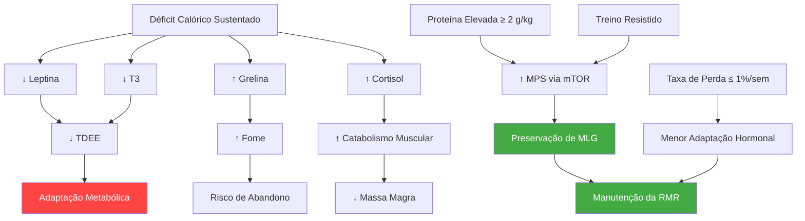

## 25. Ciência da Composição Corporal: Perda de Gordura com Preservação de Massa Magra

Este capítulo consolida a literatura científica sobre os mecanismos que determinam *o que* o corpo perde durante um déficit calórico — gordura, músculo ou ambos — e as estratégias baseadas em evidência para direcionar a perda predominantemente para o tecido adiposo. Diferente dos capítulos operacionais do protocolo, este é um capítulo de fundamentação profunda, com foco nos artigos primários que sustentam as recomendações práticas.

### 25.1. Peso Corporal vs. Composição Corporal

A balança mede massa total — água, gordura, músculo, osso e órgãos — sem distinguir a origem de qualquer variação. Duas pessoas com o mesmo IMC podem apresentar perfis de risco cardiovascular radicalmente distintos se uma tiver 18% de gordura corporal e a outra 35% [web:147].

::: {.callout-important}
**Implicação clínica:** uma perda de 5 kg na balança pode representar cenários opostos — 4,5 kg de gordura + 0,5 kg de água (excelente) ou 2 kg de gordura + 2 kg de músculo + 1 kg de água (prejudicial). A composição do peso perdido importa mais que a magnitude.
:::

#### 25.1.1. Proporção Típica de Perda

Em dietas convencionais sem exercício resistido, aproximadamente 25% do peso perdido provém de massa livre de gordura (MLG) [web:149]. Dietas de muito baixa caloria (VLCD < 800 kcal) podem elevar essa proporção [web:52]. A revisão sistemática de Chaston et al. (2007) confirmou que a fração de MLG perdida aumenta à medida que o déficit se torna mais agressivo e a ingestão proteica é insuficiente [web:153].

#### 25.1.2. Por que Preservar Massa Magra?

A MLG é o principal determinante da taxa metabólica de repouso (RMR). O músculo esquelético, embora tenha taxa metabólica específica relativamente modesta (~13 kcal/kg/dia), constitui ~40% do peso corporal e contribui para 20–30% do gasto energético de repouso [web:145]. A perda de MLG:

- **Reduz o gasto energético basal**, dificultando a manutenção do peso perdido.
- **Compromete a capacidade funcional**, afetando força, mobilidade e independência — especialmente relevante em idosos [web:131].
- **Diminui a sensibilidade insulínica** periférica, visto que o músculo é o principal destino da glicose pós-prandial [web:147].

### 25.2. Adaptação Metabólica: O Corpo Contra-Ataca

Quando o organismo detecta déficit energético sustentado, ativa uma cascata de respostas cuja finalidade evolutiva é preservar reservas de energia e promover a retomada do peso basal. Esse fenômeno, coletivamente denominado **adaptação metabólica** (ou *termogênese adaptativa*), reduz o gasto energético diário total (TDEE) além do previsto pela simples perda de massa corporal [web:143] [web:151].

#### 25.2.1. Componentes do TDEE Afetados

O TDEE pode ser decomposto em quatro componentes, todos impactados pela restrição calórica [web:143]:

| Componente | Contribuição típica | Efeito da restrição |
|---|:---:|---|
| **TMB / RMR** (Taxa Metabólica Basal) | ~60–70% | ↓ por perda de MLG + adaptação metabólica |
| **NEAT** (Termogênese de Atividade Não-Exercício) | ~15–25% | ↓ involuntária (menos inquietação, menos passos) |
| **TEF** (Efeito Térmico dos Alimentos) | ~8–10% | ↓ proporcional à menor ingestão calórica |
| **EAT** (Termogênese de Atividade por Exercício) | ~5–15% | ↓ eficiência muscular aumenta; mesmo exercício gasta menos |

::: {.callout-warning}
**Dado-chave:** Em indivíduos com restrição calórica severa, a queda no TDEE pode exceder a predição baseada em composição corporal em 200–500 kcal/dia — essa diferença é a "termogênese adaptativa" propriamente dita [web:143] [web:145].
:::

#### 25.2.2. Mecanismos Endócrinos

A adaptação metabólica é mediada por alterações hormonais coordenadas [web:143] [web:152]:

- **Leptina:** cai rapidamente com a perda de gordura, sinalizando ao hipotálamo que as reservas energéticas estão diminuindo. A queda precede a fome intensa e a redução do gasto energético.
- **T3 (triiodotironina):** redução de até 44% observada no estudo Biggest Loser, diminuindo diretamente a taxa metabólica [web:145].
- **Cortisol:** elevação sob restrição calórica, promovendo catabolismo proteico e retenção hídrica [web:106].
- **Grelina:** aumento persistente que amplifica a fome — Sumithran et al. demonstraram que essas alterações hormonais persistem por no mínimo 12 meses após a perda de peso [web:152].
- **Insulina:** queda adaptativa que favorece lipólise mas também sinaliza estado catabólico sistêmico.

#### 25.2.3. Evidência Quantitativa

Três estudos longitudinais fornecem os dados mais robustos sobre a magnitude da adaptação metabólica:

**Estudo Biggest Loser — Johannsen et al. (2012)** [web:145]: 16 participantes com obesidade classe III perderam −38 ± 9% do peso corporal em 30 semanas. Apesar de preservação relativa de MLG (apenas 17% da perda veio de MLG), a RMR caiu −504 ± 171 kcal/dia além do previsto pela mudança na composição corporal. T3 reduziu 44%.

**Bigger Loser — Follow-up de 6 anos — Fothergill et al. (2016)** [web:144]: Os mesmos participantes, 6 anos depois, haviam recuperado 41 kg dos 58 kg perdidos. A adaptação metabólica não apenas persistiu como *aumentou* para −499 ± 207 kcal/dia. Quem manteve maior perda de peso teve maior adaptação metabólica concorrente (r = 0,59, p = 0,025).

**Experimento de Minnesota (Keys, 1950):** Referência histórica citada em múltiplas revisões [web:143] [web:148]. Homens jovens submetidos a 24 semanas de semi-inanição (1.560 kcal/dia) apresentaram queda de ~40% no gasto energético — 25% atribuída à perda de peso e ~15% à adaptação metabólica pura.

::: {.callout-tip}
**Relevância para o protocolo:** A limitação do mini-cut a 30 dias visa justamente minimizar a magnitude da adaptação metabólica. Déficits mais curtos produzem adaptação proporcional menor, e o período de manutenção subsequente permite recuperação parcial dos hormônios reguladores [web:143].
:::

### 25.3. Settled Point vs. Set Point

A teoria do *set point* propõe que o corpo defende ativamente um peso geneticamente determinado. A teoria do *settled point*, mais aceita atualmente, reconhece que o peso defendido (*settled point*) é influenciado por fatores ambientais — dieta, atividade física, sono — e pode ser alterado ao longo do tempo [web:146] [web:144].

Na prática, após uma perda de peso acentuada, o corpo age como se houvesse um ponto de referência a ser restaurado: leptina cai, grelina sobe, NEAT diminui, eficiência muscular aumenta. Essas adaptações explicam por que 80% das pessoas que perdem ≥10% do peso corporal o recuperam em 5 anos [web:146]. A boa notícia é que manutenção prolongada da nova composição corporal (12+ meses) parece reduzir, embora não eliminar, a magnitude dessas pressões homeostáticas [web:151].

### 25.4. Estratégias para Preservação de Massa Magra

A pesquisa converge em três pilares para maximizar a perda de gordura e minimizar a perda de MLG durante déficit calórico.

#### 25.4.1. Proteína Elevada

A ingestão proteica é o fator nutricional isolado com maior impacto na preservação de MLG em déficit [web:148] [web:149].

| Contexto | Recomendação de proteína | Fonte |
|---|---|---|
| Atletas / treinados em déficit | 2,3–3,1 g/kg de MLG/dia | Helms et al., 2014 [web:148] |
| Adultos em déficit moderado | ≥ 1,6–2,4 g/kg/dia | ISSN [web:118]; Willoughby et al. [web:149] |
| Déficit agressivo (40%) com exercício | 2,4 g/kg/dia | Longland et al. [web:56] |
| Idosos (≥ 65 anos) em perda de peso | ≥ 1,2–1,5 g/kg/dia | PROT-AGE [web:133] |

**Mecanismo:** A proteína estimula a síntese proteica muscular (MPS) via ativação de mTOR pela leucina, e tem o maior efeito térmico entre os macronutrientes (~20–30% do conteúdo calórico é gasto na própria digestão, vs. 5–10% para carboidratos e 0–3% para lipídios) [web:143] [web:148].

::: {.callout-important}
**Estudo-chave:** Longland et al. (2016) submeteram homens jovens treinados a déficit de 40% com 2,4 g/kg/dia de proteína + exercício combinado (resistido + HIIT). O resultado foi ganho de 1,2 kg de MLG e perda de 4,8 kg de gordura em 4 semanas — demonstrando que recomposição corporal simultânea é possível em déficit agressivo com proteína suficiente e estímulo mecânico adequado [web:56].
:::

#### 25.4.2. Exercício Resistido

O treinamento de força é a segunda intervenção mais eficaz para preservar MLG durante restrição calórica, superando o exercício aeróbico isolado [web:147] [web:148] [web:122].

- **Mecanismo:** O estímulo mecânico da contração muscular contra resistência sinaliza ao corpo que o tecido muscular está sendo *utilizado* e não deve ser catabolizado como substrato energético.
- **Volume mínimo:** Manter a tonelagem semanal (séries × reps × carga) o mais próximo possível dos valores de manutenção é o fator-chave [web:122]. Reduzir volume em até 1/3 é tolerável se a intensidade relativa (% 1RM) for preservada.
- **Evidência:** No estudo Biggest Loser, a combinação de dieta + exercício vigoroso (incluindo resistido) limitou a perda de MLG a apenas 17% do peso total perdido, vs. ~25% em dietas sem exercício [web:145] [web:149].

#### 25.4.3. Taxa de Perda de Peso Controlada

A velocidade da perda de peso é inversamente proporcional à preservação de MLG [web:148]:

| Taxa de perda | Cenário | Risco para MLG |
|---|---|---|
| 0,5–0,7% do peso/semana | Recomendado para indivíduos treinados | Baixo |
| 0,7–1,0% do peso/semana | Aceitável em sobrepeso/obesos | Moderado |
| > 1,4% do peso/semana | Perda rápida / crash diet | Alto — perda substancial de MLG |

Helms et al. (2014) recomendam que atletas naturais percam 0,5–1% do peso corporal por semana durante preparação competitiva para minimizar perda de MLG e disfunção hormonal [web:148]. Um estudo com atletas militares demonstrou que perdas semanais < 0,7% permitiram ganhos modestos de MLG, enquanto perdas > 1,4% resultaram em perda significativa de tecido magro [web:69].

### 25.5. O Papel da Composição da Dieta

#### 25.5.1. Macronutrientes Além da Proteína

Embora a proteína seja o macronutriente crítico para preservação de MLG, a distribuição de carboidratos e lipídios também tem impacto [web:148]:

- **Carboidratos:** Preservam performance no treino resistido (substrato para glicólise anaeróbica), mantêm níveis de leptina mais favoráveis que dietas cetogênicas, e têm papel na sinalização de insulina pós-treino.
- **Gorduras:** Manter ≥ 15–20% do TDEE em lipídios é necessário para produção hormonal (testosterona, estrogênio) e absorção de vitaminas lipossolúveis [web:148]. Níveis < 15% em homens foram associados a queda de testosterona.

#### 25.5.2. Estratégias de Refeeding

*Refeeds* são períodos planejados de aumento calórico (tipicamente via carboidratos) inseridos durante o déficit para atenuar a adaptação metabólica [web:143]:

- **Mecanismo proposto:** O carboidrato é o macronutriente mais correlacionado com a produção de leptina. Um excedente agudo de carboidratos pode elevar transitoriamente a leptina e o TDEE, embora o efeito seja modesto (~7% de aumento no TDEE, equivalente a ~138 kcal) [web:143].
- **Aplicação prática:** No protocolo, a concentração de carboidratos no jantar (dia de treino) e o dia de maior flexibilidade calórica cumprem parcialmente essa função.

### 25.6. Mapa de Mecanismos

### 25.7. Implicações Práticas para o Protocolo

A evidência consolidada neste capítulo fundamenta as seguintes decisões operacionais do mini-cut:

| Decisão do protocolo | Fundamentação científica |
|---|---|
| Limite de 30 dias | Minimiza adaptação metabólica crônica [web:143] [web:144] |
| Proteína alvo 2,0–2,4 g/kg/dia | Faixa que preserva MLG mesmo em déficit agressivo [web:56] [web:148] |
| Manutenção do treino resistido | Sinal mecânico anti-catabólico indispensável [web:122] [web:147] |
| Déficit de ~30–35% do TDEE | Agressivo o suficiente para resultados em 30 dias, moderado o bastante para limitar perda de MLG [web:148] |
| Período de manutenção pós-cut | Permite recuperação parcial de leptina, T3 e NEAT [web:143] [web:152] |
| Carboidratos concentrados pós-treino | Suporte ao treino resistido e sinalização de leptina [web:148] |

### 25.8. FAQ — Composição Corporal

**P: É possível ganhar músculo e perder gordura ao mesmo tempo?**
R: Sim, mas a magnitude depende do nível de treinamento e da ingestão proteica. Iniciantes e pessoas com sobrepeso significativo respondem melhor. Longland et al. demonstraram ganho de 1,2 kg de MLG em déficit de 40% com 2,4 g/kg de proteína + exercício [web:56]. Indivíduos treinados avançados têm janela muito menor para recomposição simultânea [web:148].

**P: A adaptação metabólica é permanente?**
R: Não há evidência de permanência absoluta, mas os dados do Biggest Loser mostram persistência por pelo menos 6 anos [web:144]. A adaptação parece proporcional ao grau de déficit mantido — retornar à manutenção calórica por períodos prolongados reduz parcialmente a adaptação [web:143] [web:151]. Cirurgia bariátrica parece "resetar" o set point de forma mais eficaz que dieta [web:144].

**P: Dietas cetogênicas preservam mais músculo?**
R: A evidência é mista. Embora dietas cetogênicas produzam perda de peso rápida inicial, grande parte é água e glicogênio. Estudos controlados para proteína mostram que dietas cetogênicas perdem 1–3,5 kg de MLG, sem vantagem clara sobre dietas com carboidratos quando a proteína é equalizada [web:149].

**P: NEAT pode ser conscientemente mantido durante o déficit?**
R: Parcialmente. Monitorar passos diários e manter um alvo mínimo (ex.: 8.000–10.000 passos) é a estratégia mais prática, visto que a redução de NEAT é predominantemente inconsciente. A redução de NEAT pode representar 200–300 kcal/dia de queda no gasto energético [web:143].
